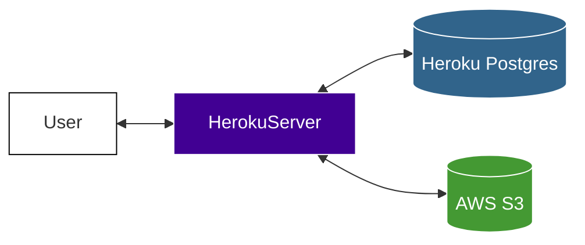

## 概要
- **触れるコーディネートアプリ**というコンセプトでWebアプリケーションを作成しました
- コーディネートを提案できるアプリケーションなのですが、服は3Dモデルを表示しさ割れるようになっています。
- 下記のPDFに詳しく書いてあります。
- [Feel-Coordination資料](https://github.com/RRRRRRR-777/Feel-Coordination/blob/master/Feel＿coordinations_資料.pdf)

## 公開URL
> https://feel-coordinations.herokuapp.com

## 技術
- 言語
  - Python
- フレームワーク
  - Django
- インフラ
  - Heroku
  - AWS S3

## インフラ構成図

## デモ
https://github.com/user-attachments/assets/ae3eff9d-7cd9-4fc3-8d84-db37690a09f6

