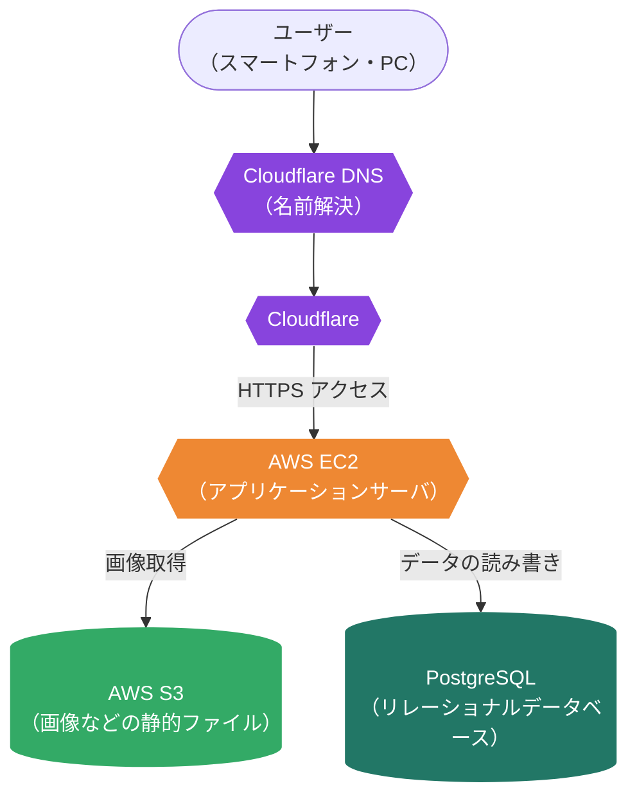

## 概要
- **触れるコーディネートアプリ**というコンセプトでWebアプリケーションを作成しました
- コーディネートを提案できるアプリケーションなのですが、服は3Dモデルを表示しさ割れるようになっています。
- 下記のPDFに詳しく書いてあります。
- [Feel-Coordination資料](https://github.com/RRRRRRR-777/Feel-Coordination/blob/master/Feel＿coordinations_資料.pdf)

## 公開URL
> https://feel-coordination.rrrrrrr777.com

## EC2 上で Django の HTTPS Web サイトを公開する方法
* 手順をドキュメント化しました
> https://steep-sheet-eef.notion.site/EC2-Django-HTTPS-Web-1e4d3bb41e64802b8dbdf90d829b643e?pvs=4

## 技術
- 言語
  - Python
- フレームワーク
  - Django
- DB
  - PostgreSQL
- インフラ
  - AWS EC2 
  - AWS S3
  - CloudFlare DNS
  - CloudFlare SSL Certificate

## インフラ構成図

```mermaid
graph TD
    User([ユーザー<br>（スマートフォン・PC）]):::person
    User --> CloudflareDNS{{Cloudflare DNS<br>（名前解決）}}:::server
    CloudflareDNS --> Cloudflare{{Cloudflare}}:::server
    Cloudflare -->|HTTPS アクセス| EC2{{AWS EC2<br>（アプリケーションサーバ）}}:::ec2

    EC2 -->|画像取得| S3[(AWS S3<br>（画像などの静的ファイル）)]:::storage
    EC2 -->|データの読み書き| PostgreSQL[(PostgreSQL<br>（リレーショナルデータベース）)]:::database

    classDef person shape:person;
    classDef server fill:#84d,color:#fff,stroke:none;
    classDef ec2 fill:#e83,color:#fff,stroke:none;
    classDef storage fill:#3a6,color:#fff,stroke:none;
    classDef database fill:#276,color:#fff,stroke:none;
```

## デモ
https://github.com/user-attachments/assets/ae3eff9d-7cd9-4fc3-8d84-db37690a09f6

